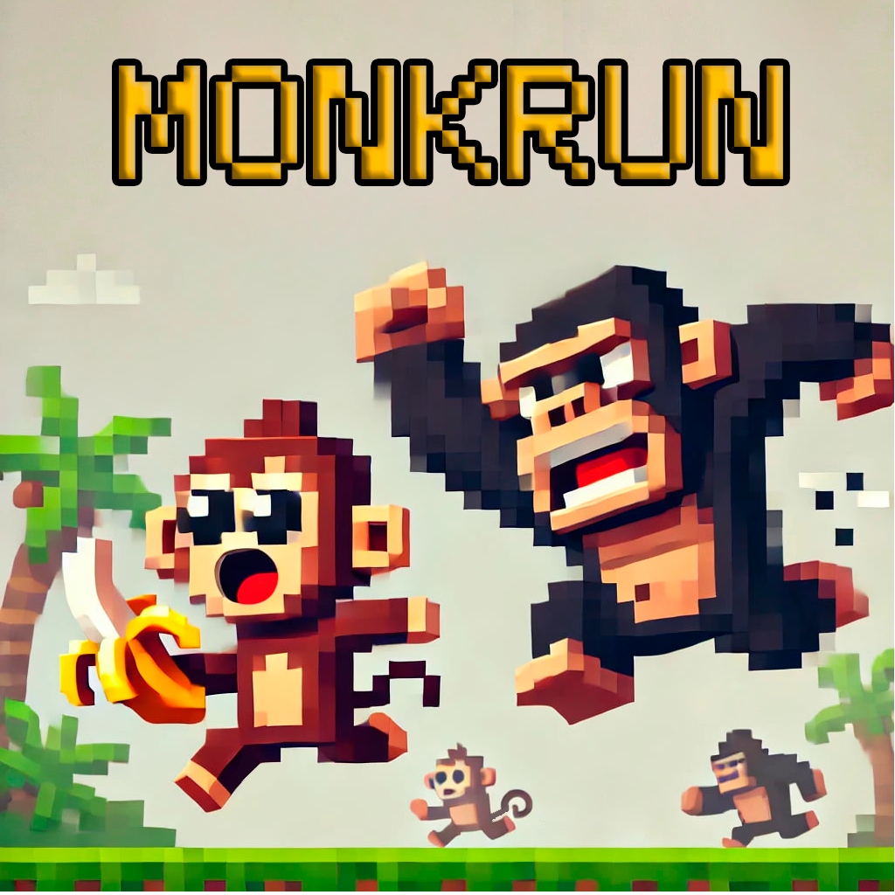
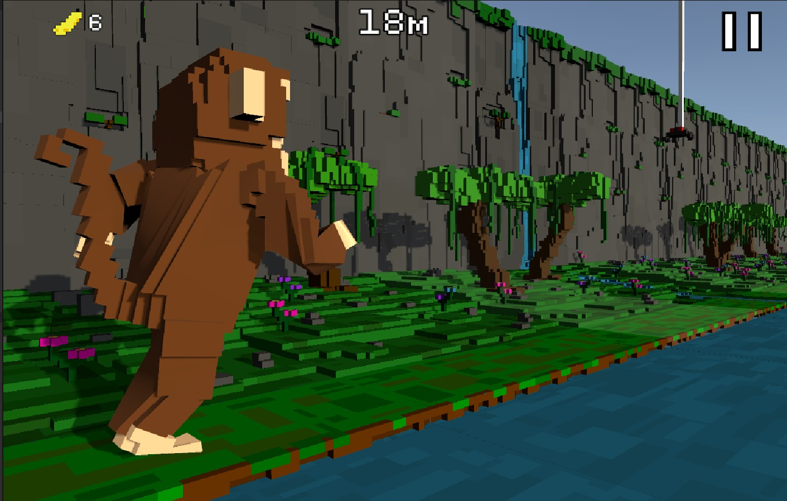
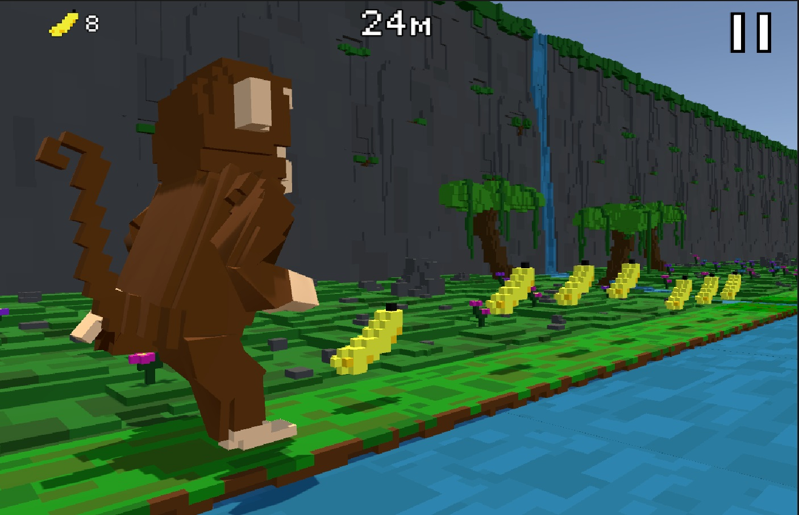

<h1 align="center">MonkRun</h1>

  

  <strong>Мобильная игра-раннер на Android про обезьянку, которая украла банан у гориллы и бежит прочь.</strong>

## 📌 О проекте

- **Разработчики:** GameMonkeys  
- **Жанр:** Бесконечный раннер  
- **Движок:** Unity  
- **Режим игры:** Однопользовательский  

## 🖼 Скриншоты  

  
  
  

## 🎮 Геймплей

- Автоматический бег вперед, возможность прыжка и приседания для уклонения от препятствий.
- Плавное увеличение скорости бега в зависимости от пройденного расстояния.
- Возможность сбора бананов для покупок во внутриигровом магазине или возрождения при поражении.
- Генерируемые препятствия: камни, реки, заливы, мухи и пауки.
- Генерируемые баффы и дебаффы в виде грибов: множитель сбора бананов, потеря половины бананов, замедление, хаотичная смена дневного цикла.

### Управление:
- **Прыжок:** свайп вверх  
- **Слайд:** свайп вниз  

## 🛠 Технологии

- **Язык разработки:** C#  
- **Движок:** Unity 2022.3 LTS  
- **Моделирование:** MagicaVoxel, Blender  
- **Анимация:** Mixamo, Unity Animator  

## 📅 Roadmap

- Добавление новых локаций  
- Добавление достижений  
- Добавление новых механик в процессе бега  

## 👥 Команда разработки

- **Антон "Alangmat" Кроликов**  
- **Николай "m0nkkke" Курицын**  
- **Максим "maksimvorobev" Воробьев**  
- **Сергей "s4lex" Келемник**  

## 📩 Контакты  
По всем вопросам и предложениям - Telegram: [@max_4u](https://t.me/max_4u)  

---

<h1 align="center"> # MonkRun (EN) </h1>

  

<strong>A mobile endless runner game for Android about a monkey who stole a banana from a gorilla and is running away.</strong>

## 📌 About the project

- **Developers:** GameMonkeys  
- **Genre:** Endless runner  
- **Engine:** Unity  
- **Game mode:** Single-player  

## 🖼 Screenshots  

  
  
  

## 🎮 Gameplay

- Automatic forward running with jump and slide mechanics to dodge obstacles.  
- Gradual increase in running speed depending on the distance traveled.  
- Collect bananas for in-game purchases or revival after defeat.  
- Procedural obstacles: rocks, rivers, swamps, flies, and spiders.  
- Procedural buffs and debuffs as a mushrooms: banana collection multiplier, loss of half the bananas, slow-motion effect, chaotic day-night cycle switching.  

### Controls:
- **Jump:** swipe up  
- **Slide:** swipe down  

## 🛠 Technologies

- **Programming language:** C#  
- **Engine:** Unity 2022.3 LTS  
- **Modeling:** MagicaVoxel, Blender  
- **Animation:** Mixamo, Unity Animator  

## 📅 Roadmap

- Adding new locations  
- Implementing achievements  
- Introducing new mechanics during the run  

## 👥 Development Team

- **Anton "Alangmat" Krolikov**  
- **Nikolay "m0nkkke" Kuritsyn**  
- **Maksim "maksimvorobev" Vorobyev**  
- **Sergey "s4lex" Kelemnick**  

## 📩 Contact  
For any questions and suggestions - Telegram: [@max_4u](https://t.me/max_4u)
